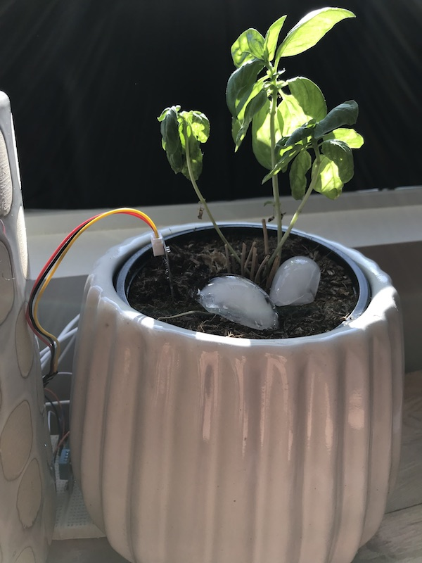

# particle-plant-monitor
A simple atmospheric monitor utilizing a Particle Photon, DHT11 temperature sensor, and a capacitive soil moisture sensor.

## Story
I like fresh basil.  Nothing tastes better than pasta or a pizza with fresh basil on top.  Unfortunately I have a lot of hobbies and sometimes forget to look after my basil plant.  (Currently named "Charlie 2.0" as it follows in the footsteps of the original "Charlie".)

To help me better take care of "Charlie 2.0" I decided to put together a little data collection system.  Hopefully I am able to use this data to better predict when I should be watering not only my basil plant, but the others around my apartment as well.

So I cobbled together some parts (with a bit of help from AliExpress), yanked my camping solar panel out of storage, and put it all together.

## Parts
- Particle Photon
- DHT11 Temperature / Humidity sensor
- Capacitive Soil Moisture Sensor "v1.2"
- 18W 5V solar panel
